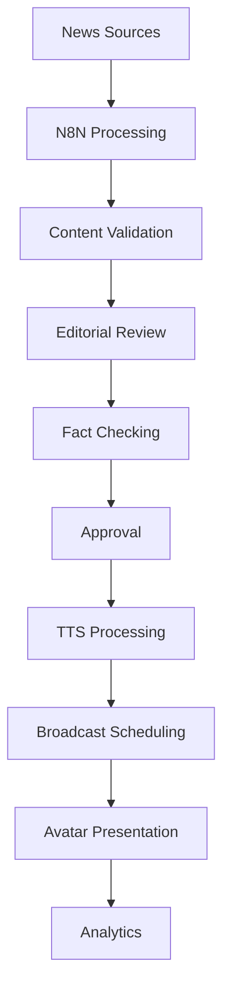

# 📰 MaâtCore News Module

A comprehensive news management system with virtual avatar integration for the MaâtCore platform.

## 🌟 Features

### Core Functionality
- **Multi-Source News Aggregation**: RSS feeds, API endpoints, webhooks, and manual entry
- **Editorial Workflow**: Content validation, fact-checking, and approval process
- **Virtual Avatar Integration**: AI-powered news presentation with TTS
- **Automated Broadcasting**: Scheduled news broadcasts with customizable formats
- **Real-time Analytics**: Comprehensive reporting and performance metrics
- **N8N Integration**: Automated workflow processing and content enrichment

### Advanced Features
- **Smart Content Processing**: Automatic text formatting for TTS optimization
- **Multi-language Support**: French and English content handling
- **Priority-based Scheduling**: Urgent, high, normal, and low priority content
- **Fact-checking Integration**: Built-in verification workflow
- **Social Media Integration**: Twitter, Facebook, and other platform connectors
- **WebSocket Real-time Updates**: Live broadcast status and content updates

## 🚀 Quick Start

### Prerequisites
- Node.js 18+ and npm
- PostgreSQL database
- Redis server
- TypeScript knowledge

### Installation

1. **Run the setup script**:
   ```bash
   node setup-news-module.js
   ```

2. **Manual setup** (if preferred):
   ```bash
   # Install dependencies
   npm install
   
   # Setup database
   npx prisma migrate deploy
   npx prisma generate
   
   # Seed with sample data
   npm run news:seed
   
   # Run tests
   npm test src/tests/news.test.ts
   ```

3. **Configure environment variables**:
   ```bash
   cp .env.example .env
   # Edit .env with your configuration
   ```

### Environment Configuration

Key environment variables for the news module:

```env
# N8N Integration
N8N_WEBHOOK_API_KEY=your-secure-api-key
N8N_WEBHOOK_URL=http://localhost:5678/webhook/news

# TTS Service
TTS_SERVICE_URL=https://api.elevenlabs.io/v1
TTS_API_KEY=your-elevenlabs-api-key
TTS_DEFAULT_VOICE_ID=your-default-voice-id

# News Processing
NEWS_AUTO_APPROVE=false
NEWS_FACT_CHECK_REQUIRED=true
NEWS_MAX_ARTICLE_LENGTH=5000
NEWS_MIN_ARTICLE_LENGTH=100

# External APIs
NEWS_API_KEY=your-newsapi-key
GUARDIAN_API_KEY=your-guardian-api-key
REUTERS_API_KEY=your-reuters-api-key
```

## 📚 API Documentation

### Authentication
All endpoints require JWT authentication with appropriate roles:
- **ADMIN**: Full access to all endpoints
- **EDITOR**: Article and broadcast management
- **USER**: Read-only access to approved content

### Core Endpoints

#### News Articles
```http
# List articles with pagination and filtering
GET /api/news/articles?page=1&limit=10&status=APPROVED&category=TECHNOLOGY

# Create new article
POST /api/news/articles
Content-Type: application/json
{
  "title": "Breaking: New AI Breakthrough",
  "content": "Detailed article content...",
  "summary": "Brief summary",
  "category": "TECHNOLOGY",
  "priority": "HIGH",
  "language": "fr",
  "tags": ["AI", "technology", "breakthrough"]
}

# Approve article (ADMIN only)
PUT /api/news/articles/{id}/approve
{
  "factCheckStatus": "VERIFIED"
}

# Update article
PUT /api/news/articles/{id}
{
  "title": "Updated title",
  "content": "Updated content"
}
```

#### News Sources
```http
# List all news sources
GET /api/news/sources

# Create news source (ADMIN only)
POST /api/news/sources
{
  "name": "Tech News RSS",
  "description": "Technology news feed",
  "sourceType": "RSS_FEED",
  "apiEndpoint": "https://example.com/rss",
  "keywords": ["tech", "innovation"],
  "categories": ["TECHNOLOGY"],
  "languages": ["fr"],
  "priority": 8,
  "syncInterval": 1800
}
```

#### Broadcasts
```http
# Schedule broadcast
POST /api/news/broadcasts/schedule
{
  "avatarId": "avatar-uuid",
  "title": "Morning News",
  "description": "Daily morning bulletin",
  "broadcastType": "LIVE",
  "scheduledAt": "2024-01-15T08:00:00Z",
  "articleIds": ["article-1", "article-2"]
}

# Update broadcast status
PUT /api/news/broadcasts/{id}/status
{
  "status": "LIVE"
}

# Get next scheduled broadcast
GET /api/news/broadcasts/next?avatarId={avatarId}
```

#### Analytics
```http
# Get analytics data (ADMIN only)
GET /api/news/analytics?period=week&category=TECHNOLOGY
```

#### N8N Webhook
```http
# N8N webhook endpoint
POST /api/news/webhook/n8n
X-API-Key: your-webhook-api-key
{
  "title": "Automated News Article",
  "content": "Content from N8N workflow",
  "category": "TECHNOLOGY",
  "sourceUrl": "https://source.com/article"
}
```

## 🏗️ Architecture

### Data Models

#### NewsSource
- Manages different content sources (RSS, API, Webhook, Manual)
- Configurable sync intervals and priorities
- Multi-language and category support

#### NewsArticle
- Core content entity with editorial workflow
- TTS-optimized text formatting
- Fact-checking and approval process
- Multi-language support

#### NewsBroadcast
- Scheduled news presentations
- Avatar and article associations
- Live and recorded broadcast types
- Real-time status tracking

#### NewsSchedule
- Recurring broadcast schedules
- Time slot management
- Category and priority filtering
- Avatar assignment

### Workflow Integration



## 🔧 Development

### Project Structure
```
src/
├── controllers/
│   └── newsController.ts      # Main business logic
├── routes/
│   └── newsRoutes.ts          # API route definitions
├── middleware/
│   └── newsAuth.ts            # Authentication & authorization
├── utils/
│   └── tts.ts                 # TTS processing utilities
└── tests/
    └── news.test.ts           # Comprehensive test suite

prisma/
├── schema.prisma              # Database schema
├── migrations/                # Database migrations
└── seeds/
    └── news-seed.ts           # Sample data seeding

docs/
└── NEWS_MODULE.md             # Detailed technical documentation
```

### Available Scripts
```bash
# Development
npm run dev                    # Start development server
npm run build                  # Build for production
npm run start                  # Start production server

# News Module Specific
npm run news:migrate           # Run database migrations
npm run news:generate          # Generate Prisma client
npm run news:seed              # Seed database with sample data
npm run news:setup             # Run complete setup

# Testing
npm test                       # Run all tests
npm run test:news              # Run news module tests only
npm run test:watch             # Run tests in watch mode

# Database
npm run db:studio              # Open Prisma Studio
npm run db:reset               # Reset database
npm run db:push                # Push schema changes
```

### Testing

The module includes comprehensive tests covering:
- API endpoint functionality
- Authentication and authorization
- Data validation
- TTS utilities
- Error handling
- N8N webhook integration

```bash
# Run specific test suites
npm test -- --testNamePattern="News Articles API"
npm test -- --testNamePattern="Authentication"
npm test -- --testNamePattern="TTS Utilities"
```

## 🔌 Integrations

### N8N Workflow
The module integrates with N8N for automated content processing:

1. **Content Aggregation**: Automatic RSS feed monitoring
2. **Content Enrichment**: AI-powered summarization and tagging
3. **Social Media Monitoring**: Real-time social media content tracking
4. **Fact-checking**: Automated verification workflows
5. **Publishing**: Multi-platform content distribution

### TTS Integration
Supports multiple TTS providers:
- **ElevenLabs**: Primary TTS service with voice cloning
- **Azure Cognitive Services**: Fallback TTS provider
- **Google Cloud TTS**: Additional language support

### Avatar System
Integrates with the existing avatar system:
- Voice assignment and management
- Lip-sync coordination
- Emotion and gesture control
- Multi-avatar broadcasting

## 📊 Analytics & Monitoring

### Metrics Tracked
- Article creation and approval rates
- Broadcast performance and engagement
- Source reliability and quality scores
- TTS processing times and success rates
- User engagement and interaction patterns

### Dashboards
- Real-time broadcast monitoring
- Editorial workflow analytics
- Content performance metrics
- System health and performance

## 🔒 Security

### Authentication
- JWT-based authentication
- Role-based access control (RBAC)
- API key validation for webhooks
- Rate limiting and request validation

### Data Protection
- Input sanitization and validation
- SQL injection prevention
- XSS protection
- Secure API key storage

### Compliance
- GDPR compliance for user data
- Content moderation and filtering
- Audit logging for all operations
- Data retention policies

## 🚀 Deployment

### Docker Deployment
```bash
# Build and run with Docker
docker build -t maatcore-backoffice .
docker run -p 3000:3000 maatcore-backoffice

# Using docker-compose
docker-compose up -d
```

### Production Considerations
- Environment variable security
- Database connection pooling
- Redis clustering for scalability
- Load balancing for high availability
- Monitoring and alerting setup

## 🐛 Troubleshooting

### Common Issues

1. **Database Connection Errors**
   ```bash
   # Check database status
   npx prisma db pull
   
   # Reset and migrate
   npx prisma migrate reset
   ```

2. **TTS Service Errors**
   - Verify API keys in environment variables
   - Check service endpoint availability
   - Review rate limiting settings

3. **N8N Webhook Issues**
   - Validate webhook API key
   - Check N8N workflow configuration
   - Review request payload format

4. **Authentication Problems**
   - Verify JWT secret configuration
   - Check user roles and permissions
   - Review token expiration settings

### Debug Mode
```bash
# Enable debug logging
DEBUG=news:* npm run dev

# Database query logging
DATABASE_LOGGING=true npm run dev
```

## 📞 Support

For technical support and questions:
- **Documentation**: `./docs/NEWS_MODULE.md`
- **API Reference**: Available endpoints in this README
- **Test Examples**: `./src/tests/news.test.ts`
- **Issue Tracking**: Create issues in the project repository

## 🔄 Updates & Maintenance

### Regular Maintenance
- Monitor database performance and optimize queries
- Update TTS service configurations
- Review and update news source configurations
- Analyze content quality and adjust filters
- Update external API integrations

### Version Updates
- Follow semantic versioning
- Run migration scripts for database changes
- Update environment variables as needed
- Test all integrations after updates

---

**Built with ❤️ for the MaâtCore ecosystem**

*This module is part of the comprehensive MaâtCore platform, providing intelligent news management and virtual avatar integration for modern content delivery.*